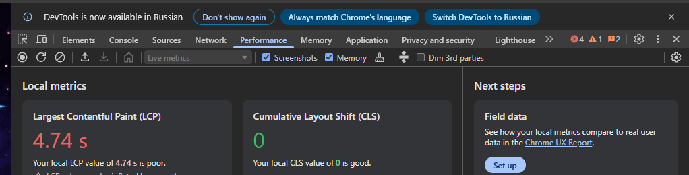
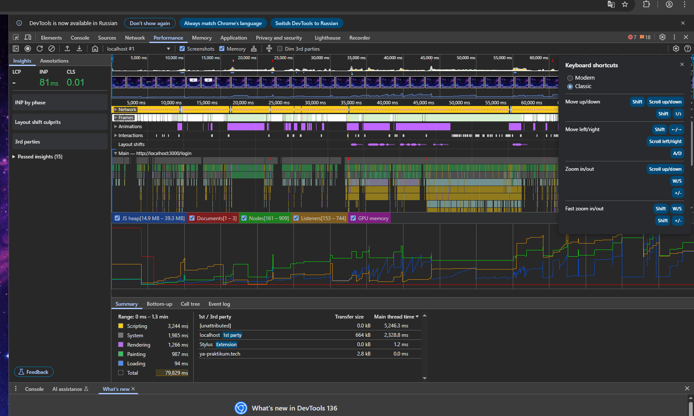
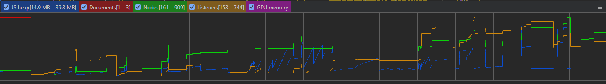
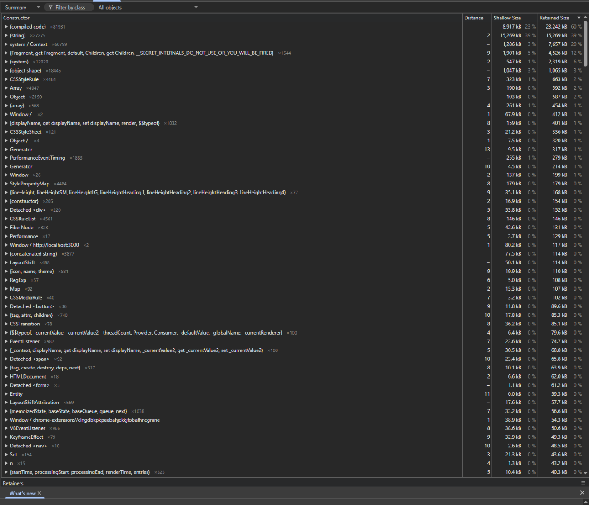
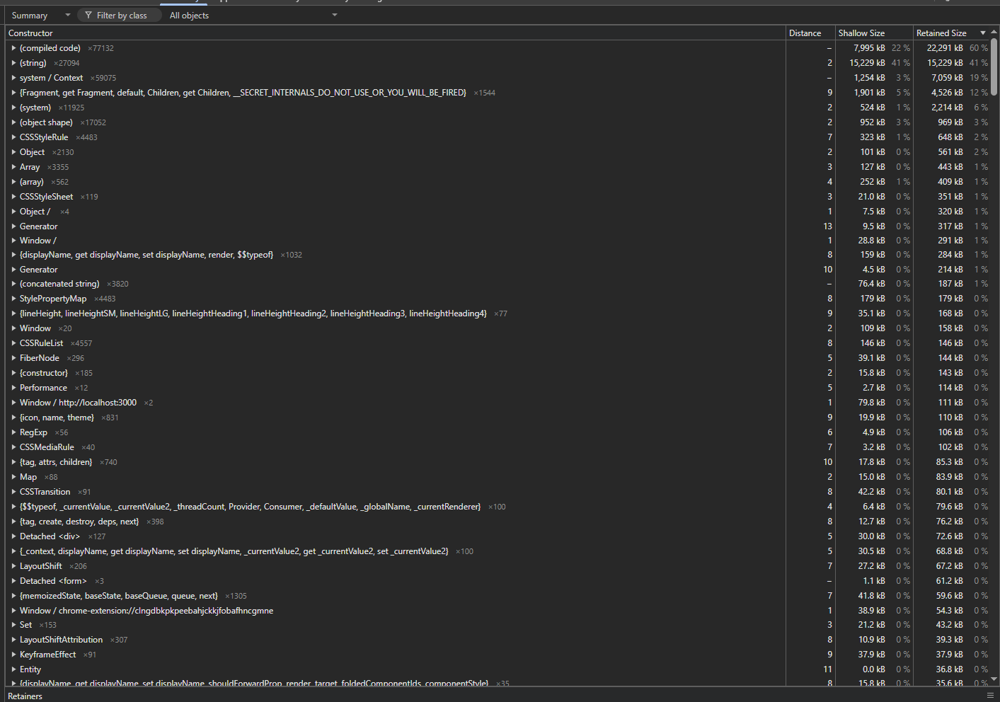

# Анализ утечек памяти

## Цель

Провести проверку приложения на наличие утечек памяти в процессе пользовательской работы с интерфейсом.

## Использованные инструменты

Для анализа использовались инструменты Chrome DevTools:

- вкладка **Performance** с включённой опцией **Memory**
- вкладка **Memory** с использованием **Heap Snapshot**

## Выполненные действия

В ходе тестирования был выполнен следующий сценарий:

- загрузка приложения;
- переходы между страницами;
- переход в игровую часть приложения;
- возврат назад;
- повторные переходы между разделами;
- повторение пользовательского сценария в течение длительного времени.

Во вкладке **Performance** анализировались:

- **JS Heap**
- **Documents**
- **Nodes**
- **Listeners**

После этого во вкладке **Memory** были сделаны снимки памяти (**Heap Snapshot**) для анализа объектов, остающихся в памяти после выполнения сценария.

## Результаты

### Performance

В ходе профилирования было зафиксировано:

- рост **JS Heap** во время пользовательских действий;
- последующее снижение памяти после работы **Garbage Collector**;
- пилообразный характер графика памяти без непрерывного монотонного роста.

Также в процессе сценария наблюдалось изменение количества объектов интерфейса:

- **Nodes**: примерно с 161 до 909;
- **Listeners**: примерно с 153 до 744.

### Heap Snapshot

При анализе снимков памяти были обнаружены:

- `Detached 
`
- `Detached <form>`
- `Detached <button>`
- `Detached `
- `Detached <nav>`

Это означает, что в памяти присутствовали DOM-элементы, уже удалённые из документа, но всё ещё удерживаемые ссылками на момент формирования snapshot.

### 1. Подготовка профилирования

### 2. Запись пользовательского сценария

### 3. График JS Heap, Nodes и Listeners

### 4. Первый Heap Snapshot

### 5. Второй Heap Snapshot

## Анализ кода

Дополнительно был выполнен анализ кодовой базы проекта с целью сопоставления результатов профилирования с конкретными компонентами и участками приложения.

В ходе анализа установлено, что в проекте отсутствуют явные классические источники утечек памяти, такие как:

* `addEventListener` без последующего снятия обработчиков;
* `setInterval` / `setTimeout` без очистки;
* `requestAnimationFrame` без отмены;
* `WebSocket`;
* `MutationObserver`, `ResizeObserver`, `IntersectionObserver`.

При этом были локализованы участки, которые потенциально близки к удержанию памяти и требуют внимания с точки зрения архитектуры и жизненного цикла компонентов:

* `src/hooks/usePage.ts` — асинхронная инициализация страницы через `useEffect` без cleanup;
* `src/slices/userSlice.ts` и `src/slices/friendsSlice.ts` — запросы `fetch` выполняются без `AbortSignal`;
* `src/store.ts` — начальное состояние приложения сохраняется в `window.APP_INITIAL_STATE` и остаётся доступным в глобальном объекте `window`;
* `src/components/Header/index.tsx` — навигационный блок размонтируется и монтируется заново при переходах между страницами;
* `src/components/UIKitDemo/UIKitDemo.tsx` — используются компоненты Ant Design, которые могут создавать дополнительные DOM-узлы и внутренние структуры.

Указанные участки не подтверждают наличие критической утечки памяти, однако они наиболее близки к потенциальному удержанию объектов в памяти и коррелируют с результатами профилирования и Heap Snapshot.

## Финальный вывод

По результатам анализа:

* критические утечки памяти в приложении **не обнаружены**;
* память освобождается сборщиком мусора;
* бесконтрольного непрерывного роста `JS Heap` не выявлено;
* в Heap Snapshot зафиксированы `Detached DOM elements`, а также рост `Nodes` и `Listeners` в пользовательском сценарии;
* результаты профилирования были сопоставлены с кодовой базой проекта, и были определены участки, наиболее близкие к потенциальному удержанию памяти.

В связи с тем, что подтверждённая критическая утечка памяти в проекте не выявлена, исправления в код не вносились. В проект был добавлен отчёт с результатами анализа текущего состояния приложения.

