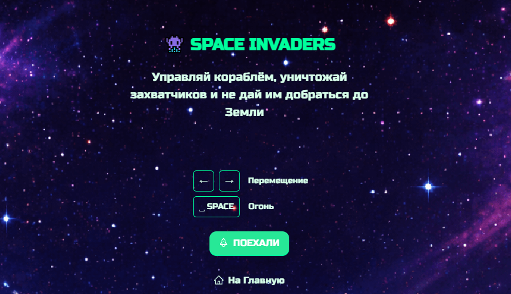

### Игра "Space Invaders"

 

### Ссылка на демонстрационное видео 5 и 6 спринтов

С отчетом о проделанной работе можно ознакомиться по ссылке [здесь](https://disk.yandex.ru/d/pb_yjGROm1UBXw)

### Ссылка на демонстрационное видео 7 и 8 спринтов

С отчетом о проделанной работе можно ознакомиться по ссылке [здесь](https://disk.yandex.ru/i/EzrnKgWHbvHLRA)

### Требования

- **Node.js** 20
- **Docker Desktop** (для варианта с Docker)
- Свободные порты: **3000** (client), **3001** (server), **5432** (postgres)

### Как запускать?

Убедитесь что у вас установлены указанные в client/package.json зависимости, для установки выполните команду `yarn install`

### Вариант 1. Всё в Docker

Один контейнер на клиент, сервер и Postgres. Ничего локально ставить не нужно, кроме Docker.
```
docker compose up --build
```
Флаг `--build` нужен только при первом запуске или после изменений в `Dockerfile.*` / `package.json` / исходниках. В остальных случаях:
```
docker compose up
```

Приложение:
- Клиент: http://localhost:3000
- API: http://localhost:3001
- Postgres: `localhost:5432`

**Остановить:**
```
docker compose down
```

### Вариант 2. Локальный dev, БД в Docker

Удобно для разработки - правки в src подхватываются на лету, ребилд не нужен.
```
docker compose up -d postgres
```
Два терминала:
```
yarn dev:server
```
```
yarn dev:client
```
Приложение: http://localhost:3000.

### Тесты

Для клиента используется [`react-testing-library`](https://testing-library.com/docs/react-testing-library/intro/)

Запуск тестов для клиента - через команду в client/package.json

"test": "jest ./", - запуск тестов
"test:coverage": "jest --coverage", - запуск тестов с покрытием

(Команда ```yarn test``` запускает тесты для клиента и сервера)

### Линтинг

```yarn lint```

либо через команду в client/package.json

"lint": "eslint .",

### Форматирование prettier

```yarn format```

### Production build

```yarn build```

---------------
Внимание, данный раздел на редактировании

И чтобы посмотреть что получилось


`yarn preview --scope client`
`yarn preview --scope server`

## Хуки
В проекте используется [lefthook](https://github.com/evilmartians/lefthook)
Если очень-очень нужно пропустить проверки, используйте `--no-verify` (но не злоупотребляйте :)

## Ой, ничего не работает :(

Откройте issue, я приду :)

## Автодеплой статики на vercel
Зарегистрируйте аккаунт на [vercel](https://vercel.com/)
Следуйте [инструкции](https://vitejs.dev/guide/static-deploy.html#vercel-for-git)
В качестве `root directory` укажите `packages/client`

Все ваши PR будут автоматически деплоиться на vercel. URL вам предоставит деплоящий бот

## Production окружение в докере
Перед первым запуском выполните `node init.js`


`docker compose up` - запустит три сервиса
1. nginx, раздающий клиентскую статику (client)
2. node, ваш сервер (server)
3. postgres, вашу базу данных (postgres)

Если вам понадобится только один сервис, просто уточните какой в команде
`docker compose up {sevice_name}`, например `docker compose up server`